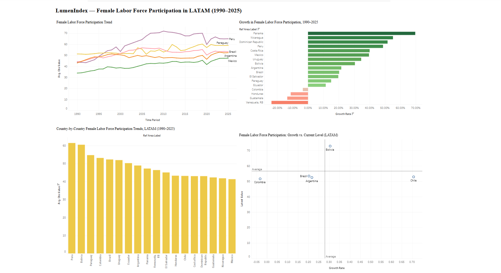

# LumenIndex — Female Labor Force Participation Dashboard (LATAM)

An interactive Tableau dashboard analyzing female labor force participation 
trends across 18 Latin American countries from 1990 to 2025, using World 
Bank World Development Indicators (WDI) data.

**[View Live Dashboard on Tableau Public →](https://public.tableau.com/app/profile/deepeka.gurunathan/viz/LATAMLaborForceDashboard/Dashboard1?publish=yes)**

---

## Data Source

World Bank World Development Indicators — *Labor force participation rate, 
female (% of female population ages 15+) (modeled ILO estimate)*, covering 
235 countries, filtered to 18 LATAM countries: Argentina, Bolivia, Brazil, 
Chile, Colombia, Costa Rica, Dominican Republic, Ecuador, El Salvador, 
Guatemala, Honduras, Mexico, Nicaragua, Panama, Paraguay, Peru, Uruguay, 
and Venezuela.

---

## Chart 1: Ranking by Average Participation (1990–2025)

Peru and Bolivia lead the region with the highest average female labor 
force participation (~60%), while Mexico sits lowest among all 18 countries 
(~40%). The roughly 20 percentage point spread between the top and bottom 
performer shows that a woman's likelihood of being in the labor force in 
LATAM varies dramatically by country, independent of regional averages.

## Chart 2: Time Series Trend — Peru, Paraguay, Brazil, Mexico, Argentina

All five countries show long-term upward trends, but at very different 
paces. Peru posted the steepest climb, peaking near 72% around 2008–2010 
before a sharp COVID-19 dip and partial recovery. Paraguay was the most 
volatile, with frequent year-to-year swings. Brazil and Argentina moved in 
close parallel through most of the period. Mexico, despite steady linear 
growth, never closed its gap with regional peers and remained the lowest 
of the five throughout.

## Chart 3: Growth Rate by Country (1990–2025)

Panama, Nicaragua, and the Dominican Republic recorded the highest 
percentage growth (50–65%) despite starting from low bases — meaning 
they closed ground fastest. Venezuela is the only country with negative 
growth (-23.6%), consistent with its prolonged economic and political 
crisis since the mid-2010s. Honduras, Guatemala, and Colombia show 
minimal growth (under 10%), flagging them as a stagnation watch group.

## Chart 4: Growth vs. Current Level (Quadrant Analysis)

Plotting growth rate against current participation level splits the 
region into four behavioral groups: countries like Bolivia sit in the 
high-growth, high-level quadrant (clear leaders); Chile sits high-level 
but lower-growth (a plateaued performer); Colombia, Brazil, and Argentina 
cluster near the regional average on both axes, indicating steady but 
unremarkable progress relative to peers.

---

## Overall Summary

Across three and a half decades, female labor force participation has 
risen in nearly every LATAM country, reflecting broad regional progress 
in workforce inclusion. However, the region is far from uniform: a 
roughly 20-point gap persists between top performers (Peru, Bolivia) and 
laggards (Mexico, Guatemala, Honduras), and that gap has not meaningfully 
narrowed despite universal upward trends. Growth rate analysis reveals 
that absolute ranking and improvement are not the same story — some 
countries starting from a low base (Panama, Dominican Republic) have 
closed ground fastest, while historically higher performers like Chile 
show comparatively flatter growth. Venezuela stands alone as the region's 
only declining case, a clear signal of its broader economic instability.

## Conclusion

Economic development alone does not predict female labor force 
participation — Chile, the highest-GDP country in the comparison set, 
ranks in the lower half on this indicator despite strong infrastructure 
and income metrics from earlier analysis in this project. This suggests 
participation is driven more by structural, cultural, and policy factors 
than by national wealth. For LSF's broader rural development index, this 
reinforces the value of tracking labor and social indicators alongside 
economic ones — a country can look developed on paper while still facing 
significant gaps in workforce inclusion. Future work should layer in 
male labor force participation to calculate a gender gap metric, and test 
correlation with rural population share to see whether participation 
patterns differ between urban and rural areas specifically.

---

## Data Sources

All data for this dashboard is sourced from publicly available open datasets.

| Dataset | Source | Coverage |
|---|---|---|
| World Development Indicators (WDI) | [World Bank](https://data.worldbank.org/country/chile) | Chile · 2000–2023 |
| VIIRS Nighttime Lights | [NASA EarthData](https://earthdata.nasa.gov/topics/human-dimensions/nighttime-lights) | LATAM · Annual |
| Population Grids | [WorldPop](https://www.worldpop.org/geodata/listing?id=75) | LATAM · Annual |
| Administrative Boundaries | [GADM](https://gadm.org/download_country.html) | Country / Municipality level |

## Current Phase

The current dashboard uses World Bank WDI data for Chile (2000–2023) as a 
pilot. Subsequent phases will integrate NASA VIIRS nighttime light intensity 
and WorldPop population density to build a composite rural development index 
across Latin American municipalities.

## Key Indicators Analyzed

GDP per capita, unemployment rate, internet penetration, mobile subscriptions, 
rural electricity access, rural water and sanitation access, life expectancy, 
urban vs rural population split, poverty headcount.
