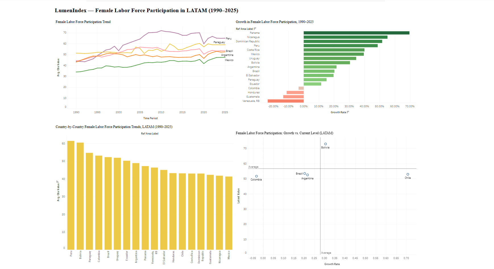

# 🌱 LumenIndex — Rural Development Index for Latin America

> Built for **Living Stones Foundation** | Applied Data & Digital Innovation Lab (LATAM)

An open-source data analysis platform that estimates economic and social development levels across Latin American countries using World Bank open data, IFPRI ASTI agricultural research data, and ILO labor force indicators — transforming scattered public data into actionable, comparable development insights.

---

## 🚀 Live Dashboard

👉 [View LumenIndex Dashboard](https://lumenindex-latam01.streamlit.app/)



---

## 📊 Dashboards

| Dashboard | Tool | Dataset | Link |
|---|---|---|---|
| LumenIndex LATAM | Streamlit | Combined · 17 countries · 1990–2020 | [Live App →](https://lumenindex-latam01.streamlit.app/) |
| Chile Development Indicators | Excel | World Bank WDI · Chile · 2000–2023 | [chile_lumenindex.xlsx](chile_lumenindex.xlsx) |
| LATAM Female Labor Force | Tableau | World Bank WDI · 18 countries · 1990–2025 | [View on Tableau Public →](https://public.tableau.com/app/profile/deepeka.gurunathan/viz/LATAMLaborForceDashboard/Dashboard1?publish=yes) |

---

## 🤖 Machine Learning Models

### Model 1 — Poverty Predictor (XGBoost Regressor)
Predicts poverty headcount % across LATAM countries using 11 development indicators as features.

| Metric | Value |
|---|---|
| Test R² | 0.83 |
| Test MAE | 2.91% |
| Training rows | 111 |
| Countries | 12 |
| Top predictors | Internet access, Life expectancy, GDP per capita |

- Generated predictions for **388 missing poverty data points** across 16 LATAM countries
- Model saved as `model1_poverty_predictor.json`

---

### Model 2 — Development Tier Classifier (XGBoost Classifier)
Classifies each country-year into **Low / Medium / High** development tier using a composite LumenIndex Score (0–100).

| Metric | Value |
|---|---|
| Test Accuracy | 100% |
| CV Accuracy | 98.86% ± 1.11% |
| Features | 12 indicators |
| Training rows | 421 |

**LumenIndex Score — Latest Results:**

| 🏆 Rank | Country | Score | Tier |
|---|---|---|---|
| 1 | Chile | 73.9 | 🟢 High |
| 2 | Peru | 50.7 | 🟡 Medium |
| 3 | Paraguay | 49.9 | 🟡 Medium |
| 4 | Panama | 49.5 | 🟡 Medium |
| 5 | Bolivia | 49.2 | 🟡 Medium |
| 6 | Uruguay | 48.9 | 🟡 Medium |
| 7 | Brazil | 47.5 | 🟡 Medium |
| 8 | Nicaragua | 46.6 | 🟡 Medium |
| 9 | Costa Rica | 46.4 | 🟡 Medium |
| 10 | Honduras | 46.2 | 🟡 Medium |
| 11 | El Salvador | 45.8 | 🟡 Medium |
| 12 | Dominican Republic | 45.7 | 🟡 Medium |
| 13 | Ecuador | 45.1 | 🟡 Medium |
| 14 | Guatemala | 43.0 | 🟡 Medium |
| 15 | Colombia | 42.6 | 🟡 Medium |
| 16 | Argentina | 41.3 | 🟡 Medium |
| 17 | Mexico | 38.9 | 🟡 Medium |

- Model saved as `model2_tier_classifier.json`

---

## 🗂️ Data Sources

| Dataset | Source | Coverage | Status |
|---|---|---|---|
| World Development Indicators (WDI) | [World Bank](https://data.worldbank.org) | Chile · 2000–2023 | ✅ Used |
| Female Labor Force Participation | [World Bank WDI](https://data.worldbank.org) | 18 LATAM countries · 1990–2025 | ✅ Used |
| IFPRI ASTI Agricultural Research | [IFPRI ASTI](https://asti.cgiar.org) | 16 LATAM countries · 1981–2020 | ✅ Used |
| LATAM Poverty Headcount | [World Bank](https://data.worldbank.org/indicator/SI.POV.NAHC) | 17 LATAM countries · 1990–2022 | ✅ Used |
| VIIRS Nighttime Lights | [NASA EarthData](https://earthdata.nasa.gov) | LATAM · Annual | ⏳ Phase 4 |
| Population Grids | [WorldPop](https://www.worldpop.org) | LATAM · Annual | ⏳ Phase 4 |
| Administrative Boundaries | [GADM](https://gadm.org) | Country / Municipality level | ⏳ Phase 4 |

---

## 🗄️ Cloud Database — Neon PostgreSQL

All datasets are stored in a cloud PostgreSQL database on Neon, accessible 24/7.

| Table | Rows | Description |
|---|---|---|
| `chile_development_indicators` | 298 | Chile WDI · 13 indicators · 2000–2023 |
| `female_labor_force_latam` | 612 | Female LFP · 18 countries · 1990–2025 |
| `asti_agricultural_research` | 2,061 | ASTI · 16 countries · 1981–2020 |
| `lumenindex_combined` | 527 | Combined dataset · 17 countries · 1990–2020 |
| `latam_poverty` | 194 | Poverty headcount · 17 countries · 1990–2022 |

---

## 🧹 Data Cleanup Process

### Dataset 1 — Chile World Development Indicators (World Bank WDI)

**Raw format:** World Bank country export CSV with 4 metadata header rows, one row per indicator, year columns spanning 1960 to present, 1,400+ indicators available.

**Steps performed:**
1. Skipped first 4 metadata rows to reach actual column headers
2. Filtered from 1,400+ indicators down to 13 development-relevant ones
3. Retained years 2000–2023 only
4. Converted World Bank `..` null placeholders to null values — no imputation applied
5. Reshaped from wide format (one column per year) to long format (one row per indicator per year)
6. Renamed verbose indicator labels to short descriptive keys
7. Rounded all values to 2 decimal places

**Outcome:** 13 indicators × 24 years = 312 rows

---

### Dataset 2 — Female Labor Force Participation (World Bank WDI)

**Raw format:** World Bank API export CSV, 235 countries, 1990–2025, 30+ metadata columns.

**Steps performed:**
1. Retained only 3 columns: `REF_AREA_LABEL`, `TIME_PERIOD`, `OBS_VALUE`
2. Dropped 27 metadata columns including AGE, FREQ, STRUCTURE, OBS_CONF, UNIT_MEASURE, SEX labels and codes
3. Filtered 235 countries to 18 LATAM countries
4. Verified zero null values — World Bank ILO estimates already interpolated at source
5. Renamed columns: `Country`, `Year`, `Female LFP Rate (%)`

**Outcome:** 18 countries × 36 years = 648 rows, zero nulls

---

### Dataset 3 — IFPRI ASTI Agricultural Research

**Raw format:** IFPRI API export CSV, multiple countries, 3 indicators, 1981–2020.

**Steps performed:**
1. Filtered to 16 LATAM countries
2. Retained columns: `REF_AREA_LABEL`, `TIME_PERIOD`, `INDICATOR_LABEL`, `OBS_VALUE`
3. Pivoted from long to wide format: one row per country per year with 3 indicator columns
4. Dropped rows with no observation values

**Outcome:** 16 countries · 3 indicators · 1981–2020 = 2,061 rows

---

### Combined Dataset

All 3 datasets merged on `country + year` with median imputation for missing values.

**Outcome:** 527 rows · 17 countries · 13 columns · 1990–2020

---

## 🗃️ Repository Structure

```
lumenindex-latam/
├── app.py                          ← Streamlit dashboard
├── requirements.txt                ← Python dependencies
├── Model1_poverty_predictor.py     ← XGBoost Regressor script
├── model2_tier_classifier.py       ← XGBoost Classifier script
├── model1_poverty_predictor.json   ← Saved Model 1
├── model2_tier_classifier.json     ← Saved Model 2
├── lumenindex_combined.csv         ← Combined dataset
├── chile_lumenindex.xlsx           ← Excel dashboard
├── WB_WDI_SL_TLF_CACT_FE_ZS.xlsx  ← Female LFP dataset
├── lumenindex_dashboard.png        ← Dashboard preview
└── README.md
```

---

## 📅 Project Roadmap

| Phase | Description | Status |
|---|---|---|
| Phase 1 | Onboarding & goal definition | ✅ Complete |
| Phase 2 | Technical foundations & dataset exploration | ✅ Complete |
| Phase 3 | Data cleanup, SQL storage & dashboards | ✅ Complete |
| Phase 4 | ML modeling — Poverty Predictor & Tier Classifier | ✅ Complete |
| Phase 5 | AI Agent — LangChain + GPT-4o natural language queries | 🔄 In Progress |
| Phase 6 | Agricultural spending forecast + FAO dataset integration | ⏳ Upcoming |
| Phase 7 | Final documentation & LSF presentation | ⏳ Upcoming |

---

## 👩‍💻 Built By

**Deepeka Gurunathan** — AI/ML Engineer
Living Stones Foundation · Applied Data & Digital Innovation Lab (LATAM)
---

*Source: World Bank WDI · IFPRI ASTI · ILO Female Labor Force · Neon PostgreSQL · 2026*
